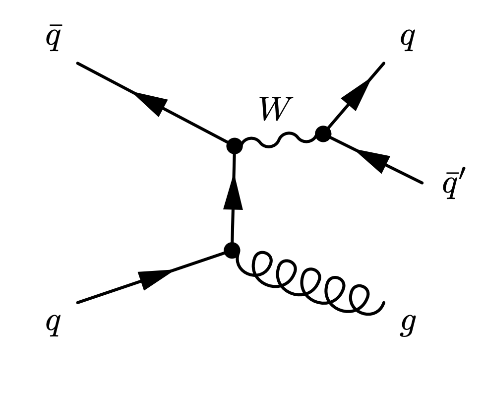

# Hackathon Prompt: Vector Boson Measurement
## IAIFI Summer School 2022

## 1. Introduction
In this lab we will investigate W bosons produced in the LHC's 8 TeV proton proton collisions. These samples were produced >4 years ago in a fun experiment that opened up the option of performing low mass resonance searches at the LHC. The studies done then have led to a wealth of results from both LHC experiments, ATLAS and CMS. To understand how this study works, we first need to introduce a few concepts.

Let's first consider the process that we would like to look for. The production of W bosons in proton collisions. Here is a Feynman diagram of the process.   The left part of the diagram represents the production of the W boson via some initial quark interaction (quarks and anti-quarks are present when two protons collide). At the right you have a gluon (bottom) that is produced in association with the W boson (top). At the top right, the W boson is decaying. It can decay to many things. The full list of W boson decays is here, in the W branching ratios section. The quark label generically means that the W boson decays to two quarks. In the reference document this is equivalent to a decay to hadrons.

Both quarks and gluons will decay into objects that we refer to as jets. A jet is collection of particles coming from an original quark or gluon. 

## 2. Measurement of Interest
You will do a **Bump Hunt** in mass *(Explanation and example code)*.
Your goal will be to extract that mass of the W from the given data using a classifier to remove as much background as possible. 

## 3. Possible Issue
Neural networks (and classifiers with enough capacity in general) have a tendency of learning features they should not. The field of machine learning concerned with studying this phenomenon is called [algorithmic fairness](https://en.wikipedia.org/wiki/Fairness_(machine_learning)) Explore how your classifier is using the mass to infer the labels (even if you do not directly use it as a training feature).
*(Explain how features can be correlated).*

## 4. Example solutions

- Moment decomposition to control classifier bias: https://arxiv.org/pdf/2010.09745.pdf
- Distance Correlation: https://arxiv.org/pdf/2001.05310.pdf

## Creating an environment with conda
'conda create -n vqq python=3.9 && conda activate vqq && pip install -r requirements.txt'

## Downloading the data
3GB Data Set
`wget https://www.dropbox.com/s/bcyab2lljie72aj/data.tgz`\
or if you don't have wget\
`curl -LO https://www.dropbox.com/s/bcyab2lljie72aj/data.tgz`\
130MB Data Set
`wget https://www.dropbox.com/s/p756oa4mfw17lfw/data.zip`\
or\
`curl -LO https://www.dropbox.com/s/p756oa4mfw17lfw/data.zip`\

**Extract the data** `unzip data.zip` or `tar -xvf data.tgz`
